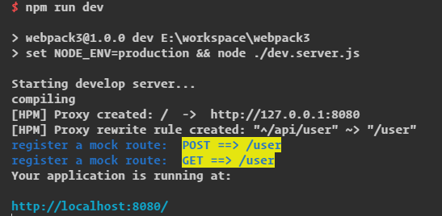

### Terra
wepack dev server and build config.  

fetures:  
* react/vue
* webpack dev/dll/build
* mock server
* api proxy
* dll  

cfg: terra.config.js  

usage: `npm run dev` || `npm run dll` || `npm run build`

